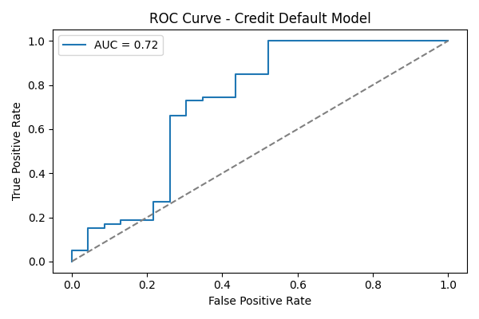

# Credit Risk Scoring Model (Logistic Regression)

## Objective

Predict the likelihood of loan default using historical loan application data and logistic regression. This project simulates how risk analysts build simple credit scoring systems in Python.

---

## Dataset

The dataset was sourced from an open Kaggle loan dataset. It includes the following relevant features:

- **Dependents**: Number of dependents
- **ApplicantIncome**: Monthly income of the applicant
- **LoanAmount**: Amount of loan applied for
- **Loan_Amount_Term**: Duration of loan in **months**, converted to years
- **Credit_History**: Whether applicant has good credit history (1/0)
- **Loan_Status**: Target variable (1 = default, 0 = repaid)

---

## Methods Used

- Cleaned and transformed raw categorical values
- Converted loan term to a normalized time unit (years)
- Built a logistic regression model using `scikit-learn`
- Evaluated model with:
  - Confusion matrix
  - Classification report (precision, recall, f1-score)
  - ROC-AUC score
  - ROC Curve plot

---

## Sample Results

- **ROC-AUC Score**: ~0.72 (may vary by dataset split)
- **Plot**: ROC Curve stored as `roc_curve.png`



---

## How to Run This Project

### Step 1: Clone this repo
```
 git clone https://github.com/rahulkr-2107/credit-risk-logistic-model.git
  cd credit-risk-logistic-model
  
### Step 2: Install required packages

pip install -r requirements.txt

### Step 3: Launch the Jupyter Notebook
jupyter notebook

Then open:
notebooks/01_credit_risk_model.ipynb

###Step 4: Run each cell step-by-step
Make sure data/loan_data.csv is present.

## Technologies Used
   Python
   pandas
   NumPy
   scikit-learn (modeling)
   Matplotlib, Seaborn (visualization)

Jupyter Notebook

Git & GitHub

📚 Learning Outcomes
Understanding of binary classification using logistic regression

Model evaluation techniques like ROC-AUC

Real-world credit risk scoring logic

End-to-end project pipeline from data → model → evaluation → deployment

👨‍💻 Author
Rahul Kumar

CFA Level 2 Candidate

Python + Finance Enthusiast

GitHub Profile
License
This project is open-source and free to use for learning purposes.

